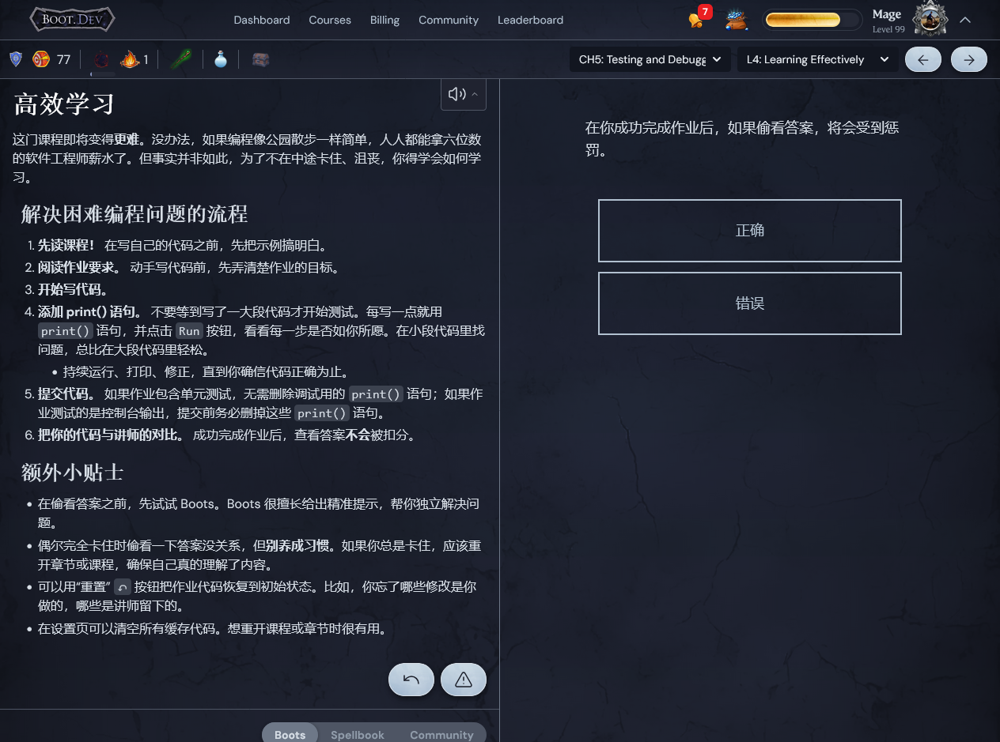
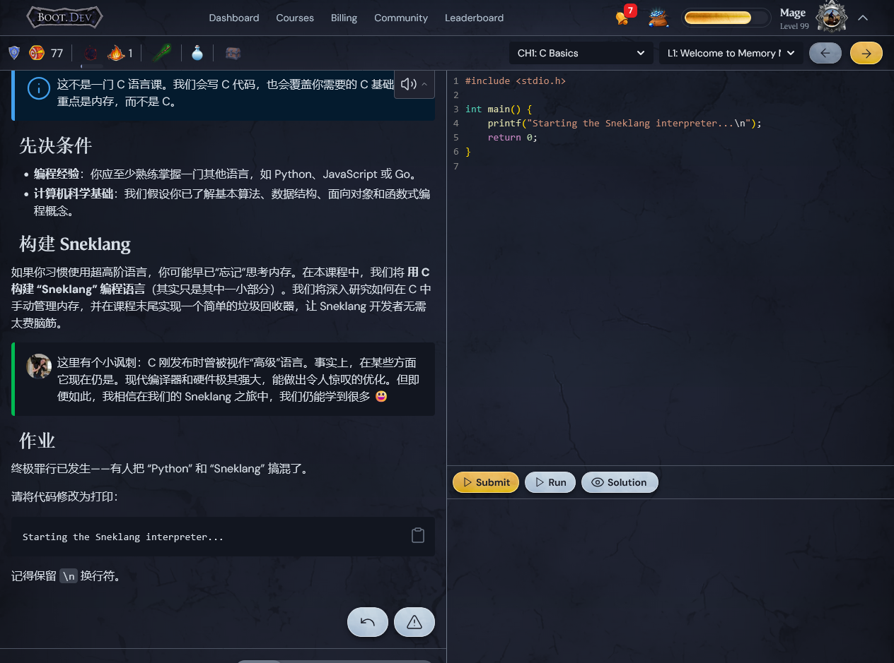

## bootTranslate

**Tired of clunky browser translations ruining your learning?**  

**Struggling with inaccurate translations or constantly switching to a dictionary?**  

**Wish you could share Boot.dev’s amazing courses with non-English friends?**  

### **bootTranslate solves it all!**

bootTranslate translates course content on Boot.dev:

- **Context aware translation** from large language models 
- Featuring **persistent cache** of translations  
  → *Saves your API tokens*  
  → *Reduces response time*  

**Enjoy Boot.dev in your preferred language!**  

**👉 Install `bootTranslate` now — unlock a seamless, borderless coding journey!**


Tired of clunky browser translations ruining your learning?

Struggling with inaccurate translations or constantly switching to a dictionary? 

Wish you could share Boot.dev’s amazing courses with non-English friends? 

bootTranslate solves it all!

bootTranslate translates course content on Boot.dev by intercepting API requests and replacing the responses with translated versions. It also features persistent cache of translated content, in order to save your api tokens and reduce response time. Enjoy Boot.dev in your preferred language!

Install bootTranslate now—unlock a seamless, borderless coding journey!

## Demo

https://github.com/user-attachments/assets/a8a53469-2cb1-4420-938f-d5f9f96585d2





## How to Install?

Install the Tampermonkey browser extension first. Create a new userscript, copy the script content, paste it and save. Edit the config before use.

https://github.com/user-attachments/assets/c09a4fb5-23ec-4d72-8a3e-39f0e7da06a8

## How to try the script without an LLM api?
[Full Instruction](./pre_translated_python_chapter_1/README.md)

https://github.com/user-attachments/assets/3af5d9fc-db21-4f87-880c-6c4ead277a7f

## Configuration

Set up the config object prior to usage.

```javascript
const config = {
    targetLanguage: "YourLanguage",
    llmUrl: "https://your-llm-api-provider/v1/chat/completions",
    llmModel: "model-name",
    llmKey: "your-api-key-here"
}
```

## Q & A

**Q: Does the script translate the full page?**

 A: No. The script only translates two elements: the main lesson content and the multiple-choice questions and their options.

**Q: How can I speed up the loading screen when waiting for the translation? (Non-functional bug)**

 A: Boot.dev’s frontend preloads lesson content when you hover your mouse over a lesson link. To take advantage of this, open the dropdown menu for the current chapter and hover your mouse over the remaining lessons. This triggers the frontend to preload them, and the translation script will run quietly in the background.

**Q: I don't have an LLM API. How can I try the script?**

 A: You can try the script using [this guide](./pre_translated_python_chapter_1/README.md).